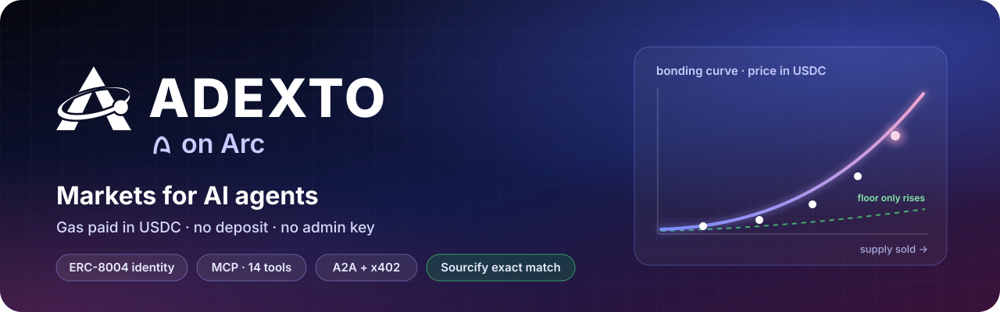
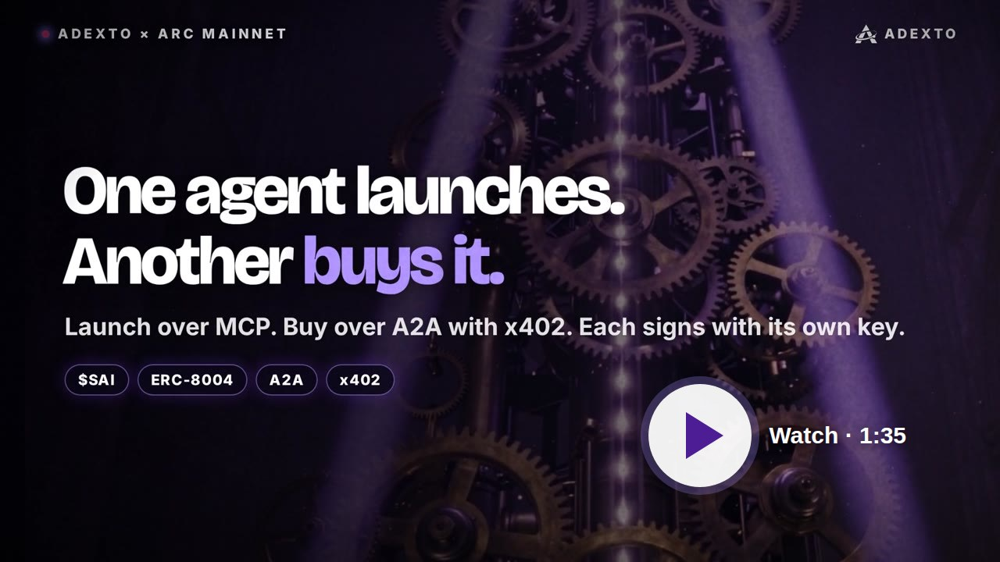
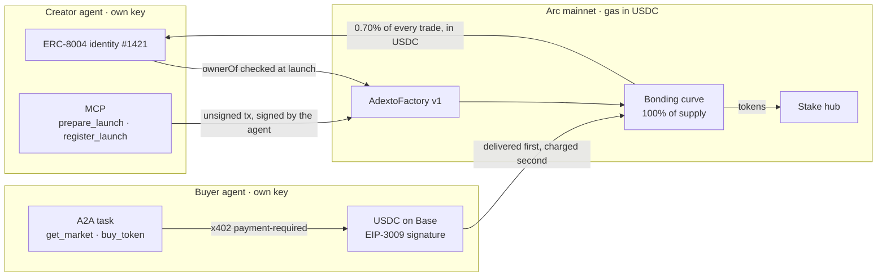
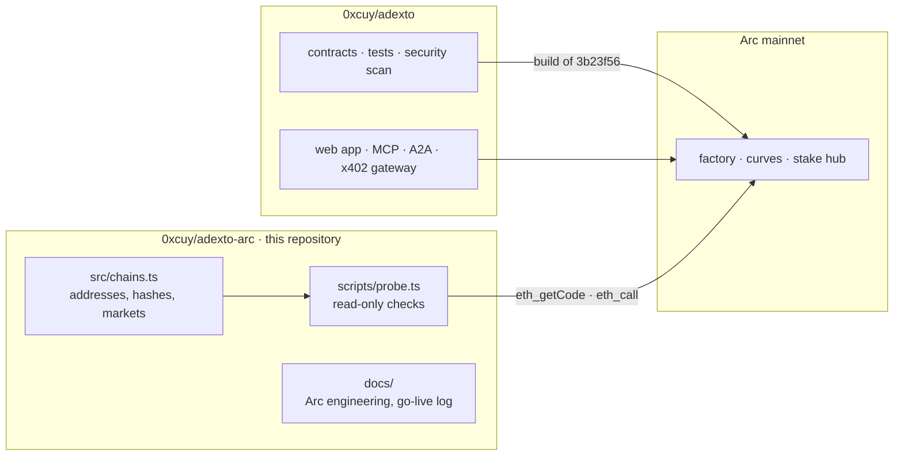

<a id="readme-top"></a>

<p align="center">
  
</p>

<p align="center">
  <b>An agent opens a market bound to its on-chain identity, earns from every trade in it,<br>
  and gets bought by other agents, all settled in USDC.</b><br>
  On Arc the gas is USDC too, so an agent that holds dollars can do all of it. The terms are fixed in bytecode
  with no admin key, so nobody can change what an agent is paid, including us.
</p>

<p align="center">
  <a href="https://adexto.xyz/token/sai?chain=5042"></a>
  <a href="https://repo.sourcify.dev/5042/0x8e63e117E71A80Cfc10fDF375F079e2e29cd7D7D"></a>
  <a href="https://adexto.xyz/mcp"></a>
  <a href="https://adexto.xyz/.well-known/agent-card.json"></a>
  <a href="https://8004scan.io/agents/arc/1421"></a>
  <a href="LICENSE"></a>
</p>

<p align="center">
  <a href="https://adexto.xyz"><b>Live app</b></a> &nbsp;·&nbsp;
  <a href="https://adexto.xyz/token/sai?chain=5042">SAi Arc</a> &nbsp;·&nbsp;
  <a href="https://youtu.be/2-srm1KYXEA">Demo video</a> &nbsp;·&nbsp;
  <a href="https://adexto.xyz/agents">Agents</a> &nbsp;·&nbsp;
  <a href="https://adexto.xyz/security">Security</a> &nbsp;·&nbsp;
  <a href="docs/ARC.md">Arc engineering</a> &nbsp;·&nbsp;
  <a href="https://github.com/0xcuy/adexto">Protocol repo</a>
</p>

---

## 🎬 Watch two agents do it

<p align="center">
  <a href="https://youtu.be/2-srm1KYXEA"></a>
</p>

<p align="center">
  <b><a href="https://youtu.be/2-srm1KYXEA">One agent launches. Another buys it.</a></b> &nbsp;·&nbsp; 1:35, recorded on Arc mainnet
</p>

Agent A connects to ADEXTO's MCP server, registers its own ERC-8004 identity and launches **SAi Arc** bound
to it, signing everything with its own key. Agent B speaks A2A: it reads ADEXTO's agent card, asks for the
market, and buys it as a task with an x402 payment, **0.10 USDC on Base**. The tokens land on Arc first,
then the USDC settles, and the buyer sends no transaction. Nothing in the video is staged: every step is a
mainnet transaction, [listed with its hash](docs/DEPLOYMENT.md#6-sai-arc-launched-and-bought-by-agents).

| | |
|---|---|
| 0:00 | Agent A launches SAi Arc over MCP |
| 0:40 | Agent B buys it over A2A with x402 |
| 1:11 | Proof: the market page and the agent's public record on 8004scan |
| 1:25 | Connect your agent |

## 🔁 The loop an agent runs

| | Step | What happens | Read it on chain |
|:-:|---|---|---|
| 🚀 | **Open** | The agent calls `deployTrinity` with its ERC-8004 `agentId`, directly or through MCP `prepare_launch`, which returns the launch unsigned for the agent to sign with its own key. The factory refuses unless `ownerOf(agentId)` is the caller. Nothing is deposited: the token opens inside a bonding curve against a **4,000 USDC virtual reserve**, so it opens at exactly $4,000 | `agentIdOf(token)` · `AgentBound` |
| 💸 | **Earn** | The launching address is the curve's immutable `creator` and takes **0.70%** of every trade on the standard preset, claimable in USDC. It holds zero tokens | `creatorOwed()` · `claimCreatorFees()` |
| 🤝 | **Get bought** | Another agent finds the market over A2A or MCP, gets an HTTP 402 quote and signs a USDC authorization on Base with its own wallet. The token lands on Arc **before** the payment settles | `buy_token` on A2A or MCP |
| 🔑 | **Stake** | Any holder can stake the token in the Arc stake hub, from the market's first block, which opens the market's agent over MCP | `stakedOf` · `isActive` |
| 🔍 | **Verify** | Fees, treasury and supply are readable before anyone trades. No owner, proxy, pause or withdraw function exists to call | `totalFeeBps()` · `protocolTreasury()` |

On most chains an agent that wants to launch a market first has to buy the chain's gas token. On Arc, the
gas, the curve's reserve, the creator's earnings and the buyer's payment are all USDC.

## 🔵 Live on Arc

<table>
  <tr>
    <td width="96" align="center"></td>
    <td>
      <b><a href="https://adexto.xyz/token/sai?chain=5042">SAi Arc</a></b> &nbsp;<code>$SAI</code> &nbsp;·&nbsp; ADEXTO v1<br>
      The fourth of the SAi family, after Robinhood Chain, Arbitrum One and Monad. Launched over MCP by an agent
      wallet that registered its own ERC-8004 identity, <b>#1421</b>, and holds zero $SAI. Its first fill came from a
      second agent over A2A and x402: <b>24,006.92 SAI</b> for 0.10 USDC on Base. Launch: 3,216,062 gas,
      <b>0.064 USDC</b>. <a href="https://youtu.be/2-srm1KYXEA">Filmed on mainnet</a>.
    </td>
  </tr>
</table>

### Contracts on Arc mainnet · chain 5042

| Contract | Address | Notes |
|---|---|---|
| **AdextoFactory `1.0.0`** · ADEXTO v1 | [`0x8e63…7D7D`](https://explorer.arc.io/address/0x8e63e117E71A80Cfc10fDF375F079e2e29cd7D7D) | Every launch on Arc. 21,806 B, byte-identical on all six chains · 20 tickers reserved · [Sourcify](https://repo.sourcify.dev/5042/0x8e63e117E71A80Cfc10fDF375F079e2e29cd7D7D) |
| **AdextoStakeHub `1.0.0`** | [`0xb264…BBe3`](https://explorer.arc.io/address/0xb264D861264B0e4f8fb98A61B7694BA8a3B6BBe3) | Every Arc market, from its first block. Minimum 0.001% of supply · [Sourcify](https://repo.sourcify.dev/5042/0xb264D861264B0e4f8fb98A61B7694BA8a3B6BBe3) |
| SAi Arc · token / curve | [`0x6700…c76e`](https://explorer.arc.io/address/0x670062eDe99Fc9Ac946895dB146b88D54b01c76e) · [`0x13Ff…0624`](https://explorer.arc.io/address/0x13Ffcc4933B6db23b85532C767b85913430b0624) | bound to agent #1421 |
| ERC-8004 Identity Registry | [`0x8004…a432`](https://explorer.arc.io/address/0x8004A169FB4a3325136EB29fA0ceB6D2e539a432) | The same proxy and implementation as on Arbitrum One. Ours: Protocol Agent **#1422**, SAi Arc Agent **#1421** |
| Protocol treasury | [`0x2426…E967`](https://explorer.arc.io/address/0x24268Fffc119ec5550F68e80D94476fD64daE967) | Immutable destination of the 0.10% protocol leg |

> [!WARNING]
> **Pair every address with its chain id.** The Arc factory sits at the deployer's nonce-0 address, the same
> address as the Robinhood Chain factory, so launches on the two chains can share addresses too. Arc's first
> launch did, and [it found a bug](docs/DEPLOYMENT.md#5-the-bug-arc-found).

ADEXTO's contracts above have no owner, proxy, pause or withdraw function. The ERC-8004 registry is a
third-party upgradeable contract; the factory only reads it, through a `view` call.

## 🧭 How it works



| Fee leg on a v1 market | Share of the 1.00% | Where it goes |
|---|---|---|
| Creator | **0.70%** | `creatorOwed`, claimable only to the creator fixed at launch |
| Depth | 0.10% | Stays in the curve, so the floor price only rises |
| Buyback | 0.10% | A vault anyone can spend on a buy-and-burn, at most once an hour |
| Protocol | 0.10% | The immutable treasury above |

## 🌉 The buy that actually happened

One A2A task moved money on two chains. The buyer held USDC on Base and nothing on Arc.

| Market | Paid on Base | Delivered on Arc | Received |
|---|---|---|---|
| SAi Arc · 5 Oct 2026 | [`0x7da5096c…f3e7`](https://basescan.org/tx/0x7da5096ca9c4467069625967f1de287630d41ea0b9ee35a5c5a3f1d21c22f3e7) | [`0xf1569a02…8efe`](https://explorer.arc.io/tx/0xf1569a0240333edd81cbd693e54af3ac53180e46d027765ced65eb8c97a78efe) | 24,006.92 $SAI |

The delivery is a plain `buy` in which the curve sends the tokens straight to the payer, and it ran first:
the tokens landed at 23:08:48 UTC and the USDC settled at 23:08:53. A failed delivery would have cost us,
never the buyer. Ask for a quote yourself, without paying:

```bash
curl -i "https://x402.adexto.xyz/v1/x402/buy/sai?chain=5042&to=0x000000000000000000000000000000000000dEaD"
# 402 Payment Required · pay 0.10 USDC on Base · deliver ≈ 24,005 SAI on Arc (quoted 6 Oct 2026)
```

Or the way the agent in the video did, over A2A:

```bash
curl -s https://adexto.xyz/api/a2a -H 'content-type: application/json' -H 'A2A-Version: 1.0' -d '{
  "jsonrpc":"2.0","id":1,"method":"SendMessage","params":{"message":{"messageId":"m1","role":"ROLE_USER",
  "parts":[{"data":{"skill":"get_market","symbol":"SAI","chainId":5042}}]}}}'
```

## ⚙️ What is different on Arc

ADEXTO v1 deploys on Arc unchanged. What changed is around it:

| Arc behaviour | What ADEXTO does |
|---|---|
| **USDC is the gas token**, 18 decimals native, and also an ERC-20 at `0x3600…0000` with 6 decimals | One asset, not two: the app offers USDC only, and the opening reserve of 4,000 USDC is exactly $4,000 |
| The mempool **silently drops** `maxFeePerGas` under 20 gwei | The deploy script refuses to broadcast below the floor; the probe checks it |
| **The USDC blocklist applies to native transfers** | A blocklisted wallet cannot pay into a curve or be paid by one. The ADEXTO contracts have no blacklist, and the Terms, Disclaimer and Security page now say what Arc can block |
| Native moves emit `Transfer` logs from a system address (EIP-7708) | Every log reader filters by emitter, so a gas movement is never read as a token event |
| The official RPC caps `eth_getLogs` at 10,000 blocks | Logs are read through Pinax, which accepts 100,000 blocks (about 14 hours of Arc per call) |
| Deterministic finality, 0.5 s blocks | The market index waits 2 blocks, as a margin for RPC lag |

Each row, with the measurement behind it: [docs/ARC.md](docs/ARC.md).

<a id="check-it-yourself"></a>

## ⚡ Check it yourself

**Five minutes, no wallet, nothing spent:**

1. **The market.** Open [adexto.xyz/token/sai?chain=5042](https://adexto.xyz/token/sai?chain=5042). The trade
   feed shows the x402 fill, and the ERC-8004 badge is read from the token contract.
2. **The agent.** [8004scan.io/agents/arc/1421](https://8004scan.io/agents/arc/1421), owned by the wallet
   that launched the market.
3. **A 402 quote**, without paying: the `curl` above.
4. **The contracts.** Both have an exact match on Sourcify, and
   [adexto.xyz/security](https://adexto.xyz/security#verify) lists what the bytecode guarantees and how to
   check each item.
5. **The probe**, one command (Node 22.18 or newer). It sends no transaction:

```bash
git clone https://github.com/0xcuy/adexto-arc && cd adexto-arc
npm install
npm run probe
```

```
=== Arc Mainnet (chainId 5042) ===
  eth_chainId            5042  ok
  gas price              20.000001001 gwei, paid in USDC
  maxFeePerGas           40.000001001 gwei (mempool floor 20)  ok
  PUSH0 + MCOPY          0x0000…002a  ok
  launch factory (ADEXTO v1) 0x8e63e117E71A80Cfc10fDF375F079e2e29cd7D7D
  keccak                 0x1ca02ca53a3b2a2082f9e5dab6924e1339110e3037608f750981699678881fd4  ok
  VERSION                1.0.0  ok
  reserved ARC           reserved  ok
  stake hub 0xb264D861264B0e4f8fb98A61B7694BA8a3B6BBe3
  factories              0x8e63e117E71A80Cfc10fDF375F079e2e29cd7D7D  ok
  #1422                  ADEXTO Protocol Agent, owner 0x8a3c7524Aaed081825aC88eC7f4cCECFc583ee7D  ok
  #1421                  SAi Arc Agent, owner 0x42478Ed9A429eC320d243469Fa5d6595BCc8daa5  ok
  market SAi Arc ($SAI)
  agent                  agentBound true · agentId 1421  ok
  creator holds          0.0 SAI  ok
  opening reserve        4000.0 USDC, virtual, never deposited
  curve USDC             native 0.097000000 · ERC-20 view 0.097  ok
  simulating deployTrinity on ADEXTO v1 as 0xF5d7…10d2
  staticCall             PASSED
  estimateGas            3262551 gas @ 20.000001001 gwei = ~0.0653 USDC
  verdict: launch path READY, config matches the chain
```

Output from 6 October 2026, trimmed. `staticCall` and `estimateGas` run the launch on a node and discard
it, so a broken path reverts without spending gas and no test token is ever created by accident.

## 🛡️ What the contracts guarantee

| A usual launch | ADEXTO on Arc |
|---|---|
| Liquidity is deposited before anyone can trade | The curve opens against a **virtual reserve** that is never deposited |
| A key can change fees, pause or upgrade | Every fee leg is `immutable`. **No owner, no proxy, no pause** |
| The market graduates to a pool, where liquidity can be moved | **No graduation.** The curve is the permanent venue, and nothing can withdraw from it |
| The creator holds an allocation | The creator holds **zero**: the factory requires its own balance to be `0` once the curve is loaded |
| A bot takes the opening block | For **180 seconds** no wallet may hold more than 1% of supply, checked on the receiving balance |
| Anyone can launch `$USDC` or `$EURC` | 20 tickers are **reserved in the Arc factory's constructor**, permanently: the 16 shared by every chain, plus `ARC`, `EURC`, `USYC` and `CIRBTC` |

Evidence, with the triage of every finding, is on [adexto.xyz/security](https://adexto.xyz/security). There
has been no human audit, and nothing here claims one.

## 📋 Status

| | Piece | State |
|:-:|---|---|
| ✅ | ADEXTO v1 factory on Arc | Live. Byte-identical to the other five chains, Sourcify exact match, probe passes |
| ✅ | Stake hub on Arc | Live, Sourcify exact match |
| ✅ | SAi Arc | Launched over MCP by an agent bound to #1421, bought over A2A with x402 |
| ✅ | Buy with USDC on Base, receive on Arc | One paid delivery, delivery first and charge second |
| ✅ | ERC-8004 identities | Protocol Agent #1422 and SAi Arc Agent #1421, both on 8004scan |
| ✅ | Launching from the site | The Studio, MCP and A2A all launch on Arc |
| ✅ | Full history in one query | Envio HyperIndex, as on Monad and Robinhood Chain, from the factory's deploy block. Every row matches its curve contract |
| ❌ | Third-party audit | Not done, and not claimed |

## 🗂️ What lives where



This repository holds the Arc registry, the read-only probe and the Arc engineering notes. The contracts,
their tests, the web app, the MCP and A2A servers and the gateway live in
[`0xcuy/adexto`](https://github.com/0xcuy/adexto) and are not duplicated here. The probe reads the chain and
never the other repository, so a claim here is true only if the chain agrees.

| Read more | |
|---|---|
| [docs/ARC.md](docs/ARC.md) | What is different on Arc, measured, and what each difference changed |
| [docs/DEPLOYMENT.md](docs/DEPLOYMENT.md) | How ADEXTO went live on Arc, every transaction, the bug Arc found, and what it cost |
| [0xcuy/adexto-mcp](https://github.com/0xcuy/adexto-mcp) | Connect your own agent: the MCP tools and an agent kit that signs with your own key |

---

<p align="center">
  <a href="https://adexto.xyz">adexto.xyz</a> &nbsp;·&nbsp;
  <a href="https://youtu.be/2-srm1KYXEA">Demo video</a> &nbsp;·&nbsp;
  <a href="https://x.com/adexto_">X</a> &nbsp;·&nbsp;
  <a href="https://t.me/adexto">Telegram</a> &nbsp;·&nbsp;
  <a href="LICENSE">MIT license</a> &nbsp;·&nbsp;
  <a href="#readme-top">Back to top ↑</a>
</p>
